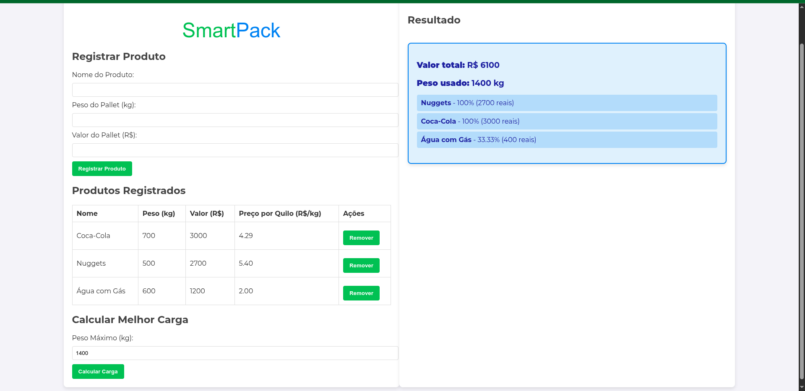

# SmartPack

**Conteúdo da Disciplina**: Algoritmos Ambiciosos 

## Alunos
|Matrícula | Aluno |
| -- | -- |
| 22/2031045  |  Caio Magalhães Lamego |
| 22/2037737 |  Matheus de Siqueira Brant |

## Sobre 
Este sistema foi desenvolvido para auxiliar no processo de otimização de cargas em caminhões de transporte de alimentos. Como cada viagem representa um alto custo, é fundamental aproveitar ao máximo o espaço disponível, transportando os produtos de maior valor possível.

Os alimentos estão organizados em pallets, contendo pacotes que podem ser separados, permitindo que apenas uma fração de cada item seja selecionada para a carga (modelo fracionado).

O sistema calcula automaticamente a melhor combinação de itens a serem carregados, respeitando os limites de peso e volume do caminhão, e priorizando aqueles que oferecem maior retorno em valor. Assim, evita-se o desperdício de espaço com produtos de baixo valor e garante-se o melhor aproveitamento logístico em cada entrega.

#### Informações do Projeto
Este projeto foi desenvolvido para a disciplina de Projeto de Algoritmos, da Universidade de Brasília, abordando o tema de Algoritmos Ambiciosos. A implementação utiliza o problema do Knapsack como base, demonstrando como otimizar a seleção de itens para maximizar o valor total dentro de um limite de peso. O sistema foi desenvolvido por Caio Lamego e Matheus Brant.

## Screenshots
**Home**

**Tabela de Produtos**

**Resposta**

**Sobre**

## Instalação 
**Linguagem**: Python, Javascript,HTML, CSS  
**Pré-Requisitos**: Ter Python instalado na máquina  
**Passo a Passo:**: Rodar no terminal: 
**1** - Instalar dependências: pip install -r requirements.txt 
**2** - python app.py (Para Linux: python3 app.py) 
**3** - Rodar o Live Server do VSCode ou abrir o arquivo index.html no navegador 

## Uso 
Primeiramente o usuário deve inserir os dados dos pallets, incluindo o nome, peso e valor de cada item. Após isso o usuário deve selecionar qual o peso máximo da carga que o caminhão pode transportar. Finalmente, basta clicar no botão "Calcular" para que o sistema processe qual a melhor combinação e quantidade de cada item a ser carregado, exibindo os resultados na tela. Com isso, o usuário poderá otimizar a carga do caminhão, garantindo que os produtos de maior valor sejam priorizados, respeitando os limites de peso.

## Outros 
Link do Repositório: https://github.com/projeto-de-algoritmos-2025/Greed_SmartPack 
Link do Vídeo de Apresentação: https://youtu.be/Y9uQ8TbETa0 

